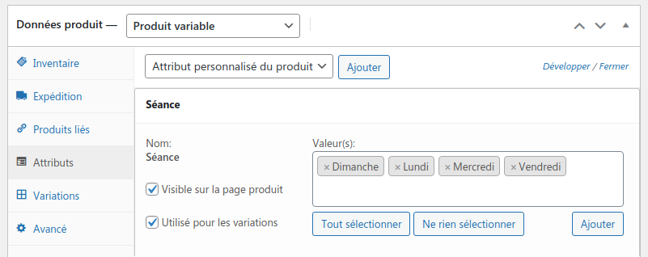
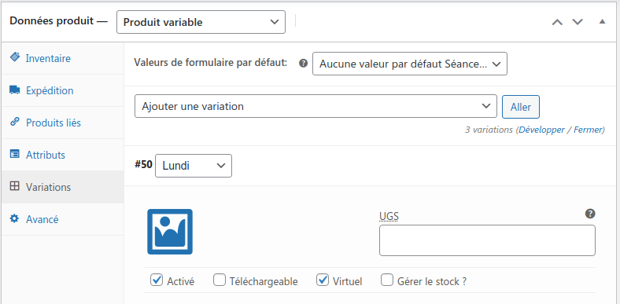

# Exercice Cinéma

<picture>

<caption>
<a href="http://www.cinemas-lumiere.com/programmation/terreaux/2021-08-27.html">http://www.cinemas-lumiere.com/</a>
</caption>
</picture>

## Description

En prenant pour modèle le site cinemas-lumiere.com réaliser un site similaire.

Pour simplifier, les dates seront remplacées par les jours de la semaine et il n'y aura qu'une séance par jour à 15h. On proposera 4 films par jour.

Vous aurez pour base un wordpress avec les plugins WooCommerce, WooCommerce Wholesale Prices, Loco Translate et Yoast Duplicate Post. Vous utiliserez le thème Storefront (thème produit par WooCommerce).

On détournera les produits en films. On pourra acheter/réserver sa place.

Chaque jour de la semaine pourra avoir des films différents, des prix différents. Le prix est de 10€ sauf les lundis et jeudis où la séance est à 7€.

Les membres seront identifiés comme étant les `abonnés` de wordpress et auront un prix de 8€ sauf les lundis et jeudis 5€.

<i>(Attention nous n'autoriseront pas pas tout le monde à s'inscrire dans les paramètres -> généraux)</i>

Il y aura une seule catégorie de produit : film

Les étiquettes de produits seront détournés pour afficher les films (menu principal) :

- AVANT-PREMIÈRES
- SORTIES NATIONALES
- JEUNE PUBLIC
- ÉVÉNEMENTS
- RENDEZ-VOUS

Les produits (films) seront de types `Produit variable`.

- Créer au préalable via `Produits -> Attributs` l'attribut `Séance` avec comme valeur Lundi, Mardi, Mercredi, Jeudi, Vendredi, Samedi et Dimanche`.
- Puis associer l'attribut sur la fiche produit en créant les variations basées surs les attributs. Leur donner le type virtuel, un le prix associé.
  
  

On omettra le détail du film (text sous le visuel sur la page du film)

On attribuera chaque jour de la semaine à une page. En utilisant un shortcode on affichera les films qui ont l'attribut du jours de la semaine repris depuis le slug de la page (`$post->post_name`).

Pour cela il vous faudra créer un plugin qui activera un shortcode `[films-day-from-slug]` qui lui-même appellera le shortcode `[products]` adapté via `do_shortcode()`.

Dans les listes de films, on afficher l'attribut `seance`.

Cette fonction devrait pouvoir vous servir d'inspiration.

```php
// source https://stackoverflow.com/questions/51936657/display-specific-custom-product-attributes-on-single-product-pages-in-woocommerc

add_action( 'woocommerce_single_product_summary', 'display_some_product_attributes', 25 );
function display_some_product_attributes(){
    // HERE define the desired product attributes to be displayed
    $defined_attributes = array('seance');

    global $product;
    $attributes = $product->get_attributes();

    if ( ! $attributes ) {
        return;
    }

    $out = '<ul class="some-attributes">';

    foreach ( $attributes as $attribute ) {

        // Get the product attribute slug from the taxonomy
        $attribute_slug = str_replace( 'pa_', '', $attribute->get_name() );

        // skip all non desired product attributes
        if ( ! in_array($attribute_slug, $defined_attributes) ) {
            continue;
        }

        // skip variations
        if ( $attribute->get_variation() ) {
            continue;
        }

        $name = $attribute->get_name();

        if ( $attribute->is_taxonomy() ) {

            $terms = wp_get_post_terms( $product->get_id(), $name, 'all' );
            // get the taxonomy
            $tax = $terms[0]->taxonomy;
            // get the tax object
            $tax_object = get_taxonomy($tax);
            // get tax label
            if ( isset ( $tax_object->labels->singular_name ) ) {
                $tax_label = $tax_object->labels->singular_name;
            } elseif ( isset( $tax_object->label ) ) {
                $tax_label = $tax_object->label;
                // Trim label prefix since WC 3.0
                if ( 0 === strpos( $tax_label, 'Product ' ) ) {
                   $tax_label = substr( $tax_label, 8 );
                }
            }

            $out .= '<li class="' . esc_attr( $name ) . '">';
            $out .= '<p class="attribute-label">' . esc_html( $tax_label ) . ': </p> ';
            $tax_terms = array();

            foreach ( $terms as $term ) {
                $single_term = esc_html( $term->name );
                // Insert extra code here if you want to show terms as links.
                array_push( $tax_terms, $single_term );
            }

            $out .= '<span class="attribute-value">' . implode(', ', $tax_terms) . '</span><progress value="' . implode(', ', $tax_terms) .
            '" max="10"><div class="progress-bar"><span style="width:'
            . implode(', ', $tax_terms) . '0%">'
            . implode(', ', $tax_terms) . '</span></div></progress></li>';

        } else {
            $value_string = implode( ', ', $attribute->get_options() );
            $out .= '<li class="' . sanitize_title($name) . ' ' . sanitize_title( $value_string ) . '">';
            $out .= '<p class="attribute-label">' . $name . ': </p> ';
            $out .= '<progress value="' . esc_html( $value_string ) . '" max="10"></progress></li>';
        }
    }

    $out .= '</ul>';

    echo $out;
}
```
