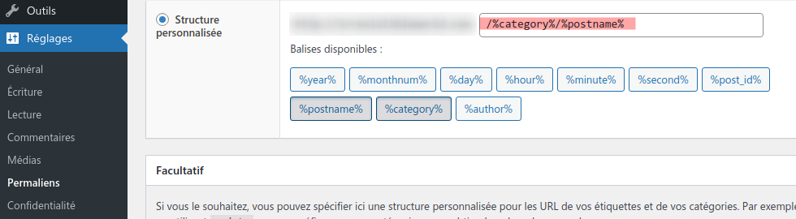

---

# Cours Wordpress Perfectionnement

---

<!--ts-->

---

## Sécurité

### De base

- Évitez de créer compte nommé admin
- Utilisez un mot de passe qui en soit un !! _Sans pour autant tomber dans la paranoïa Ö._

### ¡¡¡ Attention à toujours laisser `.php` !!!

Si vous vouliez faire une copie de wp-config.php _- par exemple, avant de vouloir l’éditer -_ **toujours conserver une extension en .php**

- Exemple: `wp-config.bak.php`
- **Jamais `wp-config.bak`**

De nombreux robots sont à l'affût de ce genre d'inattention et
si vous changez l'extension du fichier en autre chose que .php, le serveur web divulguer le code source et donc les mots de passe d’accès à votre base de données.

### Au minimum, faites au moins un export de votre base de données régulièrement.

En règle générale, il convient d’effectuer régulièrement les mises à jour de wordpress et de ses composants. Wordpress inclut désormais par défaut une màj automatique toutefois il vous appartiendra de déclencher manuellement les actualisations majeures ainsi que toutes mise à jours de thèmes.

Il est vivement recommandé d’avoir une solution de sauvegarde automatisée. Les màj sont fréquentes et il n’est pas exceptionnel que des soucis surgissent, mais aussi les erreurs humaines : ne perdez pas tout votre travail pour n’avoir pas pris de précautions.

Wordpress est réputé avoir une sécurité peu élevée :

- les correctifs de sécurité sont fréquents, les failles nombreuses.

Je vous recommande vivement l’utilisation du plugin de sécurité tel que `Wordfence`

Dans le cas de `Wordfence`, il est souhaitable d'activer son firewall qui consiste à inclure un script appelé avant wordpress via `.htaccess` (mod_php) ou `.user.ini` (fcgi/fpm) suivant la configuration
de votre serveur.

Wordfence vous forcera un mot de passe complexe, et possible que lors d'un mot de passe oublié, il oublie de vous signaler l'erreur.
Peut-être vous voudrez désactiver cette fonction `(Wordfence -> All options -> enforce strong passwords)`

Wordfence vous avertira si vous utilisez un mot de passe qui aura fuité.

### Mise à jour

Dans l’éco-système de wordpress, les mises à jour sont un élément important de la maintenance du site, et c'est pratiquement tous les jours !

Retarder une màj de quelques jours ou semaines ne présente pas un réel danger, mais laisser trop traîner vous exposera à des complications.

Même si Wordpress inclut désormais un mécanisme de mises à jours automatique, je vous recommande d’utiliser le plugin `Companion Auto Update`, d’une part il vous offrira un réglage plus fin, mais surtout il vous donnera un historique des dernières màj effectuées, un indice non négligeable en cas de soucis.

Tout particulièrement si vous faites un site pour de l'événementiel, désactivez la màj automatique des thèmes. Voir à désactiver toute
màj automatiques pour la durée de l'événement. Pour quelques semaines, ce ne sera pas un soucis, au contraire.

## Thème (theme)

Les thèmes sont rangés dans le dossier wp-content/themes/ et permettent de personnaliser le rendu du site “publique” mais aussi d’ajouter des fonctionnalités spécifiques.

Documentation officielle en anglais https://codex.wordpress.org/Theme_Development

Un thème est composé au minimum de deux fichiers `style.css` et `index.php`.

- ### `style.css`

  C'est ici que se fait la déclaration d’un thème se fait via des commentaires en tête du fichier.

  ```css
  /*
  Theme Name: Twenty Thirteen
  Theme URI: http://wordpress.org/themes/twentythirteen
  Author: the WordPress team
  Author URI: http://wordpress.org/
  Description: The 2013 theme for WordPress takes us back to the blog, featuring a full range of post formats, each displayed beautifully in their own unique way. Design details abound, starting with a vibrant color scheme and matching header images, beautiful typography and icons, and a flexible layout that looks great on any device, big or small.
  Version: 1.0
  License: GNU General Public License v2 or later
  License URI: http://www.gnu.org/licenses/gpl-2.0.html
  Tags: black, brown, orange, tan, white, yellow, light, one-column, two-columns, right-sidebar, flexible-width, custom-header, custom-menu, editor-style, featured-images, microformats, post-formats, rtl-language-support, sticky-post, translation-ready
  Text Domain: twentythirteen
  
  This theme, like WordPress, is licensed under the GPL.
  Use it to make something cool, have fun, and share what you've learned with others.
  */
  ```

- ### `functions.php`

  Déclaration des fonctionnalités communes au thème tel que les zones de widgets.

- ### `index.php`

  La maquette principale. Dans le cas d'un thème parent (et non enfant), ce fichier sera requis pour pouvoir utiliser tout autre maquette.

- ### `front-page.php`

  Maquette de la page d’accueil.

- ### `home.php`

  Maquette de la page ‘blog’ _(derniers articles)_

- ### `single.php`

  Maquette d’affichage d’un article/page.

  - `single-{post-type}.php`

    pour un type spécifique (ex: `single-product.php` pour un post de type `product` pour un produit WooCommerce)

- ### `category.php`

  Comme son nom l’indique prendra en charge les catégories des articles (taxonomie `category` en relation avec les `post`).

  - `category-ID.php` ou `category-slug.php` pour prendre la main pour la category par son ID ou son `slug` (en interne Wordpress l'appelle `name`)

  Plus en détail (anglais) https://codex.wordpress.org/Theme_Development

### Typiquement vous intéresseront dans un thème :

- `header.php`
- `footer.php`
- `sidebar.php`

## Thème enfant _(child theme)_

Si l’on devait modifier le comportement d’un thème existant et ne pas se priver des améliorations apportées par les auteurs du thème, nous utiliserons un thème enfant.

Pour les thèmes populaires, vous pourrez souvent trouver un .zip pour initialiser un thème enfant.
Si le thème est un peut sophistiqué, il n’est pas rare que certains éléments doivent être déclarés dans `functions.php` pour que le sous thème fonctionne comme prévu.

La déclaration de ce sous-thème se fait également via commentaires dans `style.css`

A la ligne Template: saisir le nom du dossier du thème parent

```css
/*
Theme Name: MinimalistBlogger Child Theme
Theme URI: https://www.telmplate.co.il
Author: https://www.template.co.il
Author URI: https://www.template.co.il
Description: Free MinimalistBlogger Child theme, created by
www.template.co.il, will help you to do Safe updates, Extend your
MinimalistBlogger template, by wordpress codex guideline.
Template: minimalistblogger
License: GNU General Public License v2 or later
License URI: http://www.gnu.org/licenses/gpl-2.0.html
Version: 1.0.0
Text Domain: MinimalistBlogger-child
*/
```

Exemple : ce sous-thème n’était pas fourni par les développeurs du thème original et comportait une erreur, il convient de supprimer le fichier index.php qui rend inutilisable la section blog (retournant une page vide).

https://www.template.co.il/wp-content/child-themes/minimalistblogger-child-theme.zip

Pour récupérer le style du thème parent il faut ajouter quelques lignes dans `functions.php`. Par défaut, un thème enfant ne va pas l'inclure.

```php

// Au chargement de wordpress invoquer la fonction load_child_theme_enqueue_scripts()
add_action('wp_enqueue_scripts', 'load_child_theme_enqueue_scripts');
function load_child_theme_enqueue_scripts()
{
  // Inclure le style.css du thème parent
  wp_enqueue_style('parent-theme-style', get_template_directory_uri() .
  '/style.css');
  // Inclure le style.css the thème enfant (dans cet ordre vous avez le dernier mot)
  wp_enqueue_style('child-theme-css', get_stylesheet_uri());

  // Charger script.js du thème enfant (en spécifiant qu'il requiert jQuery)
  wp_enqueue_script(
    'child-theme-js', // nom unique
    get_stylesheet_directory_uri() . '/script.js', // url du script
    array('jquery'), // dépendances
    '1.0', // version (utile pour contourner le cache en chargeant /script.js?v=1.0)
    true // charger le script en pied de page (juste avant le </body>)
  );
}
```

## Extension _(plugin)_

Les plus utilisés : https://fr.wordpress.org/plugins/browse/blocks/

### bien pratiques

- Show Hooks
- Admin Columns
- Companion Auto Update
- No Category Base (WPML)
- Redirections
- Imsanity - _limiter la taille des images_
- SVG Support - _format vectoriel_
- Webp Express - _le format WebP réduit le poids des images ~50%_
- Side Cart WooCommerce - _permettre l'utilisation du cache de page sur une boutique._
- Advanced Custom Fields _(ACF)_ - _gérer des options/meta pour tous les types de contenu._
- Custom Post Type - _créer des types de contenus personnalisés_

## Les codes courts _(shortcode)_

```
[exemple arg1='val1' ...]
```

Le shortcode est un outil très utilisé pour la personnalisation de sites. De nombreux plugins/themes vous donnes accès à des appels de ce type.

Exemple : WooCommerce [woocommerce-shortcodes](https://docs.woocommerce.com/document/woocommerce-shortcodes/)

```
[products limit="4" columns="4" orderby="popularity" class="quick-sale" on_sale="true" ]
```

### Il est facile de créer son propre shortcode et c'est souvent la façon simple d'intervenir proprement sur un site pour des besoins spécifiques.

- soit via `functions.php`
- soit via un plugin

#### Exemple

```php
function my_shortcode_func($atts) {
  $a = shortcode_atts(array(
      'attr1' => 'attr1 default value',
      'attr2' => 'attr2 default value',
    ), $atts
  );

  $html = '<div>'
    . 'You called my_shortcode with'
    . ' attr1="' . htmlspecialchars($a['attr1']) . '"'
    . ' and attr2="' . htmlspecialchars($a['attr2']) . '"'
    . '</div>';
  return $html;
}
add_shortcode('my_shortcode', 'my_shortcode_func');
```

```html
[my_shortcode attr1=”Bonjour”] Retournera :

<div>
  You called my_shortcode with attr1=”Bonjour” and attr2=”attr2 default value”
</div>
```

## Widget

S’il vous faut développer un widget, je vous encourage à privilégier l’utilisation d’un shortcode qui pourra être appelé via le widget “HTML personnalisé”.

Rien n’empêchera plus tard de créer un widget (on pourra utiliser des listes déroulante par exemple) qui appellera la même fonction que celle du shortcode. En quelque sorte, le widget peut se présenter comme le `GUI` à votre shortcode.

## Performance

### SEO

#### `Réglage -> Permalien` :



Saisir dans structure personnalisée : `/%category%/%postname%`

Yoast SEO (wordpress-seo) est actuellement le plugin phare, mais il faut bien penser à faire le tour de sa configuration (saisir les données relatives aux réseaux sociaux, mais aussi supprimer “Archives” des titres.

Le plugin `Redirections` est un bon complément en pensant à activer “Surveillez les modifications de permaliens dans les publications WordPress.” et de garder l’historique des 404. Dans son onglet des options, pensez à activer “Surveiller les modifications de(s) produits” (si vous utilisez WooCommerce) et changer à “Ignorer tous les paramètres de requête” (sinon les redirections ne fonctionneront pas pour les visiteurs qui arriveront depuis Facebook pour cause du fbclid qui sera ajouté à l’url)

### Cache

Pour accélérer votre site et augmenter la capacité du serveur web vous pouvez utiliser un plugin de cache (Parmi les nombreux plugins pour cela, nous regarderont un peut `W3 Total Cache` pour vous aider à comprendre les différents aspects du cache).

Remarque : dans le cas d’une boutique pensez bien à utiliser un panier Ajaxé.

### WP-CLI

https://wp-cli.org/fr/

Relativement simple à installer sous linux ou sur mac, le support est limité sous windows.

Il vous permettra entre autres d’effectuer des rechercher/remplacer à l’échelle du site, nécessaire lors de la mise en ligne ou du changement d’adresse/nom de domaine du site. Il vous permettra également de changer le mot de passe d’un utilisateur quand la fonction mail de votre site ne fonctionne pas. (Ex: quand votre site est en local)

## Les `hooks`

https://developer.wordpress.org/plugins/hooks/

- Actions
- Filters

## The Loop

https://codex.wordpress.org/The_Loop

## `WP_Query`

https://developer.wordpress.org/reference/classes/wp_query/

```php
<?php

// The Query
$the_query = new WP_Query( $args );

// The Loop
if ( $the_query->have_posts() ) {
    echo '<ul>';
    while ( $the_query->have_posts() ) {
        $the_query->the_post();
        echo '<li>' . get_the_title() . '</li>';
    }
    echo '</ul>';
} else {
    // no posts found
}
/* Restore original Post Data */
wp_reset_postdata();
```

### Alternative

```php
<?php
// the query
$the_query = new WP_Query( $args ); ?>

<?php if ( $the_query->have_posts() ) : ?>

    <!-- pagination here -->

    <!-- the loop -->
    <?php while ( $the_query->have_posts() ) : $the_query->the_post(); ?>
        <h2><?php the_title(); ?></h2>
    <?php endwhile; ?>
    <!-- end of the loop -->

    <!-- pagination here -->

    <?php wp_reset_postdata(); ?>

<?php else : ?>
    <p><?php _e( 'Sorry, no posts matched your criteria.' ); ?></p>
<?php endif; ?>
```

```php
// Display posts by author, using author id:
$query = new WP_Query( array( 'author' => 123 ) );


// Display posts by author, using author ‘user_nicename‘:
$query = new WP_Query( array( 'author_name' => 'rami' ) );

// Display posts from several specific authors:
$query = new WP_Query( array( 'author' => '2,6,17,38' ) );

// Exclude Posts Belonging to an Author
// Display all posts except those from an author(singular) by prefixing its id with a ‘-‘ (minus) sign:
$query = new WP_Query( array( 'author' => -12 ) );

// Multiple Author Handling
// Display posts from multiple authors:
$query = new WP_Query( array( 'author__in' => array( 2, 6 ) ) );

// You can also exclude multiple author this way:
$query = new WP_Query( array( 'author__not_in' => array( 2, 6 ) ) );

```

### Category Parameters #Category Parameters

Show posts associated with certain categories.

- cat (int) – use category id.
- category_name (string) – use category slug.
- category\_\_and (array) – use category id.
- category\_\_in (array) – use category id.
- category\_\_not_in (array) – use category id.

```php
// Display posts that have one category (and any children of that category), using category id:
$query = new WP_Query( array( 'cat' => 4 ) );

// Display posts that have this category (and any children of that category), using category slug:
$query = new WP_Query( array( 'category_name' => 'staff' ) );

// Display posts that have this category (not children of that category), using category id:
$query = new WP_Query( array( 'category__in' => 4 ) );

// Display posts that have several categories, using category id:
$query = new WP_Query( array( 'cat' => '2,6,17,38' ) );

// Display posts that have these categories, using category slug:
$query = new WP_Query( array( 'category_name' => 'staff,news' ) );

// Display posts that have “all” of these categories:
$query = new WP_Query( array( 'category_name' => 'staff+news' ) );

// Display all posts except those from a category by prefixing its id with a ‘-‘ (minus) sign.
$query = new WP_Query( array( 'cat' => '-12,-34,-56' ) );

// Display posts that are in multiple categories. This shows posts that are in both categories 2 and 6:
$query = new WP_Query( array( 'category__and' => array( 2, 6 ) ) );

// To display posts from either category 2 OR 6, you could use cat as mentioned above, or by using category__in (note this does not show posts from any children of these categories):
$query = new WP_Query( array( 'category__in' => array( 2, 6 ) ) );

// You can also exclude multiple categories this way:
$query = new WP_Query( array( 'category__not_in' => array( 2, 6 ) ) );
```

### Simple Taxonomy Query:

#### Display posts tagged with bob, under people custom taxonomy:

```php
$args = array(
    'post_type' => 'post',
    'tax_query' => array(
        array(
            'taxonomy' => 'people',
            'field'    => 'slug',
            'terms'    => 'bob',
        ),
    ),
);
$query = new WP_Query( $args );
```

### Multiple Taxonomy Handling:

#### Display posts from several custom taxonomies:

```php
$args = array(
    'post_type' => 'post',
    'tax_query' => array(
        'relation' => 'AND',
        array(
            'taxonomy' => 'movie_genre',
            'field'    => 'slug',
            'terms'    => array( 'action', 'comedy' ),
        ),
        array(
            'taxonomy' => 'actor',
            'field'    => 'term_id',
            'terms'    => array( 103, 115, 206 ),
            'operator' => 'NOT IN',
        ),
    ),
);
$query = new WP_Query( $args );
```

### Show Posts based on a keyword search

```php
$query = new WP_Query( array( 's' => 'keyword' ) );
```

### Custom SQL (SQL direct)

https://developer.wordpress.org/reference/classes/wpdb/

```php
<?php

global $wpdb;

$results = $wpdb->get_results(
  "
  SELECT *
  FROM $wpdb->posts
  WHERE `post_type`='post'
  LIMIT 4
  "
  );

// ou encore
$results = $wpdb->get_results(
  "
  SELECT *
  FROM {$wpdb->prefix}posts
  WHERE `post_type`='post' LIMIT 4
  "
  );
```

est l'équivalent de

```php
$query = new WP_Query(
    array(
        'post_type'      => 'post',
        'posts_per_page' => 4
    )
);
```

### Se protéger de l'injection SQL

```php
<?php
$metakey   = 'Funny Phrases';
$metavalue = "WordPress' database interface is like Sunday Morning: Easy.";

$wpdb->query(
   $wpdb->prepare(
   "
   INSERT INTO $wpdb->postmeta
   ( post_id, meta_key, meta_value )
   VALUES ( %d, %s, %s )
   ",
   array(
         10,
         $metakey,
         $metavalue,
      )
   )
);
```

Ou utiliser [wpdb::\_real_escape( string $string )](https://developer.wordpress.org/reference/classes/wpdb/_real_escape/)

```php
// Sync Server timezone with MYSQL timezone
date_default_timezone_set('Europe/Paris');
$wpdb->time_zone = 'Europe/Paris';
```
